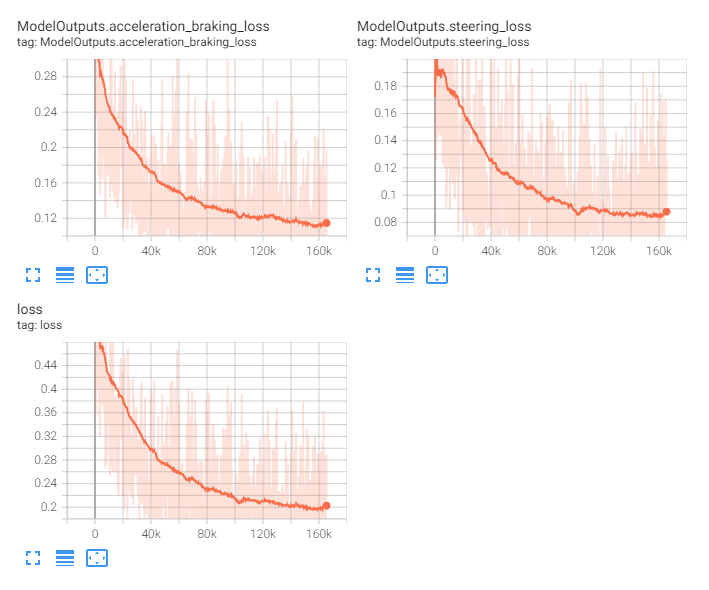
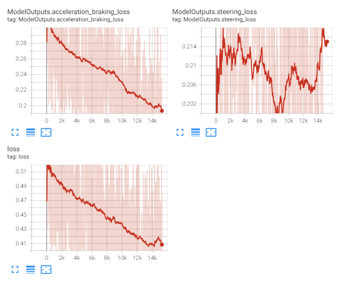

<< [Back](../../../)

# model_0003_xception

This model line consists of the CNN ([`Xception`](../project_info/xception.md)) part only, and acceleration and braking outputs have been combined into a single output. From now on [`Balancing_v3`](../project_info/data_balancing.md) is also being used to balance the data and we no longer need to use a custom model as in the [`model_0002_xception`](../model_0002_xception) model. This also means that compared to the previous model it consumes much fewer data to train - half of the batch size from the buffers of each output.

## List of the models:
- [`model_0003_xception_v1`](#model_0003_xception_v1)
- [`model_0003_xception_v2`](#model_0003_xception_v2)
- [`model_0003_xception_v3`](#model_0003_xception_v3)
- [`model_0003_xception_v4`](#model_0003_xception_v4)

 
 

## model_0003_xception_v1

Training periods: `April 22nd-24th` (batches: *0-24500*, off-stream), `May 2nd-7th` (batches: *24500-162650*, streamed), `May 7th` (batches: *162650-165250*, streamed)  
Training batches (total): *165250*

*Model summary:*  
- Total params: `23,519,466`
- Trainable params: `23,464,938`
- Non-trainable params: `54,528`

*Model architecture:*  

*Tensorboard logs:*  

This model is similar to the [`model_0002_xception_v1`](../model_0002_xception) model - it consists only of the [`Xception`](../project_info/xception.md) model as the CNN backbone, a single densely-connected layer, but the difference is now it contains only 2 heads (acceleration and braking have been combined), each containing 3 densely-connected layers with the number of neurons in each of the consecutive layers being divided by 4 for the heads and the regression output layers for each of the heads (outputs).

This model started as a longer-term test of the new [`Balancing_v3`](../project_info/data_balancing.md), which brought back all outputs to the data samples (with the trade-off of slight data unbalance, read more on the [`Balancing`](../project_info/data_balancing.md) page) and combined acceleration and braking outputs into one to match more how the inputs to the game are working - GTA5 internally combines acceleration and braking using some additional logic. The other reason we decided to combine these outputs was that the model has been predicting both acceleration and braking values at the same time, which was never present in the training data but we figured it could be because of the generalization process. The idea is that combined acceleration and braking should yield better results since acceleration and braking won’t work against each other.

As mentioned earlier, the training data contains data for all of the outputs again. This means we train the model in a standard way again, consume fewer samples per batch, and most importantly train all outputs at the same time and on the same inputs (the outputs should become more coherent).

This was the first model to use [`Convcam`](../project_info/convcam.md).

The model performed quite well and has been later streamed replacing [`model_0003_xception_v2`](#model_0003_xception_v2) on the stream.

This model (orange line) compared to the [`model_0002_xception_v1`](../model_0002_xception) model (gray line) shows a higher loss, mostly due to slight unbalance and probably more feature-reach data, but also performed better:  

*Some examples of this model during different stages of trainig:*

**May 3rd**, batch: *52340*:  
  
**May 4th**, batch: *67260*:  
  
**May 4th**, batch: *67480*:  
  
**May 4th**, batch: *86290*:  
  
**May 7th**, batch: *162654*:  
  

Then, despites loss getting lower, the model started performing worse, and we think it tried to tell us at some point:  
  
  

 
 

## model_0003_xception_v2

Training periods: `May 1st-2nd` (batches: *0-15250*, streamed)  
Training batches (total): *15250*

*Model summary:*  
- Total params: `23,519,466`
- Trainable params: `23,464,938`
- Non-trainable params: `54,528`

*Model architecture:*  

*Tensorboard logs:*  

This model is identical to the above, [`model_0003_xception_v1`](#model_0003_xception_v1) model - it consists of the [`Xception`](../project_info/xception.md) model as the CNN backbone, a single densely connected layer, and 2 heads containing 3 densely-connected layers with the number of neurons in each of the consecutive layers being divided by 4 for the heads and the regression output layers for each of the heads (outputs).

**This is the first streamed model.**

Despite being identical to the above model, it did not learn the same. We stopped training it after only *15250* batches and switched to the [`model_0003_xception_v1`](#model_0003_xception_v1) model we know works. Later we figured out that the difference between the models might be that the [`model_0003_xception_v1`](#model_0003_xception_v1) has been trained using slightly *broken* data which probably let it train better initially (but would not yield a better model long-term). Additionally, as we later discovered with the [`model_0004_inceptionresnetv2`](../model_0004_inceptionresnetv2), we probably should be more patient and let the model train for longer and it could finally start converging (the model did not steer when we stopped training it thinking it does not learn and won’t learn).

Twitch has already removed some of the past DVR recordings as of the time of making this description and we weren't able to clip this model anymore.

 
 

## model_0003_xception_v3

Training periods: `May 2st-3nd` (batches: *0-17500*, off-stream)  
Training batches (total): *17500*

*Model summary:*  
- Total params: `23,519,466`
- Trainable params: `23,464,938`
- Non-trainable params: `54,528`

*Model architecture:*  

*Tensorboard logs:*  

This model is identical to the [`model_0003_xception_v1`](#model_0003_xception_v1) and [`model_0003_xception_v2`](#model_0003_xception_v2) models.

This is a test model after some code updates related to how the buffers are begin filled in (the issue described in [`model_0003_xception_v2`](#model_0003_xception_v2)). Quickly falling loss signalized something's wrong and upon debugging a new issue in the code has been discovered and fixed. This model has not been streamed.

 
 

## model_0003_xception_v4

Training periods: `May 2st-3nd` (batches: *0-17500*, off-stream)  
Training batches (total): *17500*

*Model summary:*  
- Total params: `23,519,466`
- Trainable params: `23,464,938`
- Non-trainable params: `54,528`

*Model architecture:*  

*Tensorboard logs:*  

This model is identical to the [`model_0003_xception_v1`](#model_0003_xception_v1), [`model_0003_xception_v2`](#model_0003_xception_v2) and [`model_0003_xception_v3`](#model_0003_xception_v3) models.

The only reason for the training of this model (which was also really short) was to make sure the issue described in the [`model_0003_xception_v3`](#model_0003_xception_v3) model has been fixed. This model has not been streamed.
